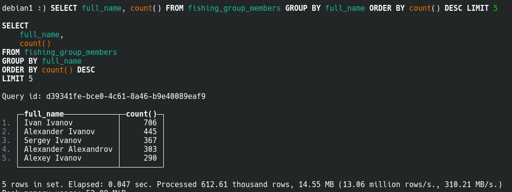
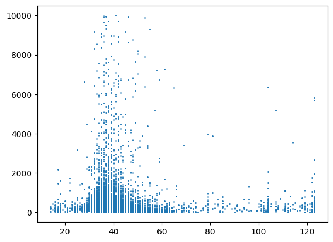
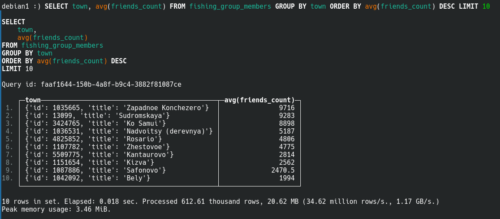
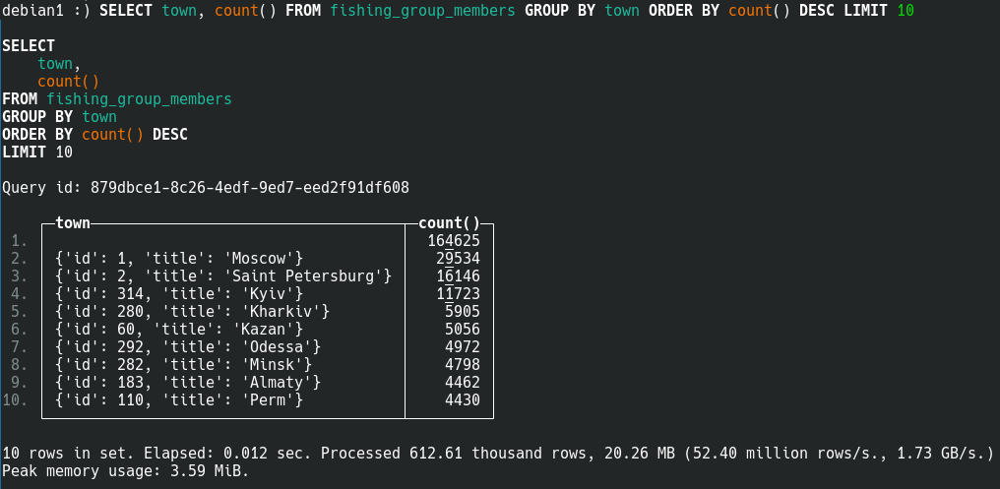

# 1) Top 5 most frequent full_names

# 2) Scatter plot age to friends_count

# 3) Top 10 towns by average friends count

# 4) Top 10 most frequent towns

# Exact queries:
- CREATE TABLE fishing_group_members (user_id_vk UInt32, full_name String, last_seen String, town String, mobile_phone String, home_phone String, friends_count UInt32, bdate String, age Float64) ENGINE = MergeTree PRIMARY KEY (user_id_vk)

- INSERT INTO fishing_group_members (user_id_vk, full_name, last_seen, town, mobile_phone, home_phone, friends_count, bdate, age) SELECT user_id_vk, full_name, last_seen, town, mobile_phone, home_phone, ROUND(friends_count), bdate, age FROM file(members_df.csv)

1) SELECT full_name, count() FROM fishing_group_members GROUP BY full_name ORDER BY count() DESC LIMIT 5

2) [plt.scatter(df['age'], df['friends_count'], s=1)] - check `analysis.ipynb`

3) SELECT town, avg(friends_count) FROM fishing_group_members GROUP BY town ORDER BY avg(friends_count) DESC LIMIT 10

4) SELECT town, count() FROM fishing_group_members GROUP BY town ORDER BY count() DESC LIMIT 10